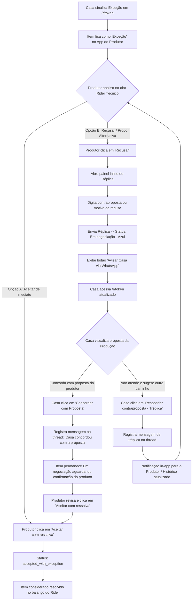
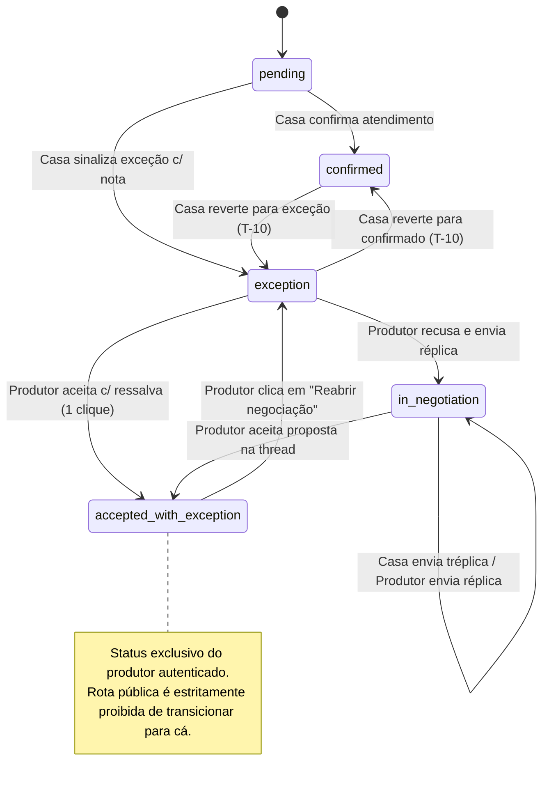

# Desenho de UI/UX e Especificação de Experiência
**Funcionalidade:** RF-14 — Negociação de Exceção do Rider Técnico via Réplica/Tréplica  
**Tarefa Relacionada:** T-17  
**Direção Visual:** Nocturne (acento roxo/lilás `#9184d9`, tipografia Inter, cantos 8–14px, hairlines sutis, microinterações de 0.18s, WCAG 2.2 AA)

---

## 1. Mapeamento de Estados Visuais do Item de Rider

O RF-14 introduz uma evolução na máquina de estados do item de rider para evitar bloqueios indefinidos no cálculo de completude (`hasMandatoryPendingOrException`), mantendo total clareza e rastreabilidade sobre acordos e itens em aberto.

### Matriz de Estados, Cores, Ícones e Rótulos (Nocturne)

| Estado Interno (`status`) | Condição / Gatilho | Rótulo Visível (Badge) | Cor / Tokens Nocturne | Ícone (Lucide) | Impacto em `hasMandatoryPendingOrException` |
| :--- | :--- | :--- | :--- | :--- | :--- |
| **`confirmed`** | Casa confirmou o item sem ressalva | **Confirmado** | Esmeralda (`bg-emerald-500/10 text-emerald-700 dark:text-emerald-400 border-emerald-500/25`) | `<CheckCircle2 />` | **Resolvido** (Não bloqueia) |
| **`pending`** | Casa ainda não respondeu sobre o item | **Pendente** | Âmbar suave (`bg-amber-500/10 text-amber-800 dark:text-amber-300 border-amber-500/25`) | `<Clock />` | **Bloqueia** se for inegociável |
| **`exception`** *(sem réplica)* | Casa sinalizou que não atende e registrou motivo | **Exceção** | Púrpura / Alerta (`bg-purple-500/15 text-purple-900 dark:text-purple-300 border-purple-500/30` ou destrutivo se inegociável) | `<AlertTriangle />` | **Bloqueia** se for inegociável |
| **`exception`** *(com réplica/tréplica ativa)* | Produtor recusou com proposta ou Casa enviou tréplica | **Em negociação** | Azul (`bg-blue-500/15 text-blue-800 dark:text-blue-300 border-blue-500/30`) | `<MessagesSquare />` | **Bloqueia** se for inegociável (continua em tratativa) |
| **`accepted_with_exception`** | Produtor aceitou formalmente a ressalva/alternativa | **Aceito c/ ressalva** | Ciano/Teal Nocturne (`bg-teal-500/15 text-teal-800 dark:text-teal-300 border-teal-500/30`) | `<CheckCheck />` | **Resolvido** (Não bloqueia mais a completude, mantendo distinção visual) |

> **Princípio de Diferenciação Visual e Ausência de Colisão (Lei de Miller & Heurística 4):**
> - **`confirmed`** (Verde esmeralda) transmite atendimento pleno do item solicitado.
> - **`accepted_with_exception`** (Teal/Ciano + `CheckCheck`) transmite resolução pactuada — visualmente distinto de "Confirmado", não mascarando que houve alteração no equipamento original, e distinto de estados de erro.
> - **`Em negociação`** (Azul `blue-500` + `MessagesSquare`): a escolha do azul elimina qualquer colisão visual com a família roxo/púrpura de "Exceção" e com o acento `#9184d9` dos botões de ação clicáveis na mesma tela (ex.: "Enviar Réplica").

---

## 2. Fluxo Geral de Interação



### Regra de Confirmação Humana Obrigatória (Sem Fechamento Silencioso)
Quando a casa clica em **"Concordar com Proposta"**, essa ação **não fecha o item automaticamente** para `accepted_with_exception`. A ação registra na thread a concordância formal da casa (*"A casa de show concordou com a proposta da produção."*), atualiza o histórico e notifica o produtor. O fechamento formal do item continua exigindo o clique explícito do produtor em **"Aceitar com ressalva"**, respeitando a convenção do sistema de que a validação final técnica cabe sempre à equipe do artista.

---

## 3. Wireframes de Baixa Fidelidade e Experiência das Telas

### 3.1. Aba Rider Técnico do Produtor (`shows.$id.tsx`)

#### Estado A: Item em "Exceção" com Ações de Decisão
```text
┌──────────────────────────────────────────────────────────────────────────────────────┐
│ [PA SOM]  Microfone Shure Beta 58A  x4   [Inegociável]             [ ⚠ Exceção ]     │
│ Especificação: Cápsula supercardioide para vocalistas principais                     │
│                                                                                      │
│ ┌─ NOTA DA CASA DE SHOW ───────────────────────────────────────────────────────────┐ │
│ │ ⚠ "Dispomos de 2x Beta 58A e 2x SM58 convencionais. Atende para os backing vocals?"│ │
│ └──────────────────────────────────────────────────────────────────────────────────┘ │
│                                                                                      │
│ Ações do Produtor:                                                                   │
│ [ ✓ Aceitar com ressalva ]    [ ✕ Recusar / Propor Alternativa ]                     │
└──────────────────────────────────────────────────────────────────────────────────────┘
```

#### Estado B: Painel de Réplica Expandido (Inline ao Clicar em "Recusar")
Sem modais intrusivos; expansão inline no próprio card (Heurística 3):
```text
┌──────────────────────────────────────────────────────────────────────────────────────┐
│ [PA SOM]  Microfone Shure Beta 58A  x4   [Inegociável]             [ ⚠ Exceção ]     │
│ Especificação: Cápsula supercardioide para vocalistas principais                     │
│                                                                                      │
│ ┌─ RESPOSTA DA PRODUÇÃO (RÉPLICA) ─────────────────────────────────────────────────┐ │
│ │ Proponha uma alternativa viável ou justifique a necessidade do item:             │ │
│ │ ┌──────────────────────────────────────────────────────────────────────────────┐ │ │
│ │ │ Os 2 SM58 atendem os backings, mas precisamos de mais 1 Beta 58 pro vocal    │ │ │
│ │ │ principal e 1 reserva de palco. Conseguem locar 1 unidade adicional?         │ │ │
│ │ └──────────────────────────────────────────────────────────────────────────────┘ │ │
│ │ [ Cancelar ]                                            [ Enviar Réplica ➔ ]    │ │ │
│ └──────────────────────────────────────────────────────────────────────────────────┘ │
└──────────────────────────────────────────────────────────────────────────────────────┘
```

#### Estado C: Histórico de Negociação Ativo + Botão de Reenvio WhatsApp
```text
┌──────────────────────────────────────────────────────────────────────────────────────┐
│ [PA SOM]  Microfone Shure Beta 58A  x4   [Inegociável]      [ 💬 Em negociação ]     │
│                                                                                      │
│ ┌─ HISTÓRICO DE NEGOCIAÇÃO ────────────────────────────────────────────────────────┐ │
│ │ 🏠 Casa de Show (14/09 14:20):                                                   │ │
│ │   "Dispomos de 2x Beta 58A e 2x SM58. Atende?"                                    │ │
│ │                                                                                  │ │
│ │ 👤 Produção (14/09 16:05):                                                       │ │
│ │   "Os 2 SM58 atendem backings, mas precisamos de 1 Beta 58 extra pro lead vocal. │ │
│ │    Conseguem locar?"                                                             │ │
│ └──────────────────────────────────────────────────────────────────────────────────┘ │
│                                                                                      │
│ ┌─ 🟢 REENVIAR ATUALIZAÇÃO VIA WHATSAPP ───────────────────────────────────────────┐ │
│ │ [ 💬 Avisar Casa via WhatsApp ] ─ Abre mensagem com link de resposta oficial     │ │
│ └──────────────────────────────────────────────────────────────────────────────────┘ │
│                                                                                      │
│ [ Aceitar condição atual com ressalva ]               [ Adicionar nova réplica ]     │
└──────────────────────────────────────────────────────────────────────────────────────┘
```

---

### 3.2. Experiência da Casa de Show em `/r/[token]` (Fricção Zero)

A casa de show não precisa de login nem treinamento prévio:
```text
┌──────────────────────────────────────────────────────────────────────────────────────┐
│ [PA SOM]  Microfone Shure Beta 58A  x4   [Inegociável]      [ 💬 Ajuste Solicitado ] │
│ Sua observação anterior: "Dispomos de 2x Beta 58A e 2x SM58. Atende?"                │
│                                                                                      │
│ ┌─ RETORNO DA PRODUÇÃO DO ARTISTA ─────────────────────────────────────────────────┐ │
│ │ 👤 Mensagem da Produção:                                                         │ │
│ │ "Os 2 SM58 atendem backings, mas precisamos de 1 Beta 58 extra pro lead vocal.   │ │
│ │  Conseguem locar essa unidade?"                                                  │ │
│ └──────────────────────────────────────────────────────────────────────────────────┘ │
│                                                                                      │
│ Como a casa pode responder:                                                          │
│ [ ✓ Concordar com Proposta ]              [ 💬 Responder contraproposta (Tréplica) ] │
└──────────────────────────────────────────────────────────────────────────────────────┘
```
- **Clique em "Concordar com Proposta":** registra imediatamente a concordância da casa na thread via auto-save, mantendo o item sob validação final do produtor.
- **Clique em "Responder contraproposta":** abre campo de texto inline com botão **"Enviar Resposta"**, salvando a tréplica no mesmo padrão anti-IDOR já vigente.

---

### 3.3. Indicador no Relatório de Produção (`shows.$id_.ficha.tsx`)

Para preservar as 6 colunas existentes da tabela sem causar quebra horizontal em telas mobile ou na impressão, a negociação é expressa na célula **"Status da Casa"**:

```text
┌─────────────────────────────────┬─────┬──────────────┬───────────────────────────────┐
│ Item & Especificação            │ Qtd │ Grau         │ Status da Casa                │
├─────────────────────────────────┼─────┼──────────────┼───────────────────────────────┤
│ Microfone Shure Beta 58A        │  4  │ Inegociável  │ 💬 Em negociação              │
│ Shure Beta 58A supercardioide   │     │              │ Úl.: Produção solicitou loc.  │
│                                 │     │              │ de 1 unidade adicional        │
├─────────────────────────────────┼─────┼──────────────┼───────────────────────────────┤
│ Mesa Yamaha CL5                 │  1  │ Inegociável  │ ✓ Aceito c/ ressalva          │
│ Dante 64 canais                 │     │              │ Acordado: Mesa QL5 c/ Rio32   │
└─────────────────────────────────┴─────┴──────────────┴───────────────────────────────┘
```
- Em tela: badge azul `Em negociação` ou ciano `✓ Aceito c/ ressalva` com snippet da mensagem mais recente em `text-[10px]`.
- Em impressão/PDF: texto em preto com alta legibilidade (`print:text-black`), sem truncamento.

---

## 4. Texto da Mensagem de WhatsApp (Heurística 2 e Prevenção de Desvios)

A mensagem aproveita a função `buildWhatsAppLink` existente. O texto aplica a **Heurística 2 (Mundo Real)** e a **Heurística 5 (Prevenção de Erros)**, explicitando de forma amigável por que a resposta oficial deve ser dada através do link:

```text
Olá! Aqui é da produção do show de *{{artist_name}}* ({{show_date}}).

Atualizamos a negociação do rider técnico sobre o item *{{item_name}}*:

> "{{reply_summary}}"

Para que o acordo fique registrado diretamente na ficha oficial de montagem do palco, por favor responda pelo link exclusivo:
🔗 {{rider_public_url}}

(Basta clicar no link e confirmar ou responder — sem necessidade de login).

Muito obrigado pela parceria! 🎸
```

---

## 5. Avaliação Heurística de Nielsen

1. **Visibilidade do status do sistema:** Estados distintos (Confirmado, Pendente, Exceção, Em negociação, Aceito com ressalva) visíveis no resumo superior e nos cards individuais.
2. **Correspondência com o mundo real:** Termos da rotina de produção de shows ("Réplica", "Tréplica", "Ressalva", "Montagem de palco").
3. **Controle e liberdade do usuário:** Formulário de réplica cancelável a qualquer momento; reversibilidade das decisões.
4. **Consistência e padrões:** Padrão de cards expansíveis alinhado com a conferência física do palco e demais abas do sistema.
5. **Prevenção de erros:** O texto do WhatsApp e a interface pública canalizam a resposta para o link oficial, evitando mensagens perdidas em chats pessoais.
6. **Reconhecimento em vez de memorização:** Histórico integral das rodadas visível inline para produtor e casa de show.
7. **Flexibilidade e eficiência:** Atalho direto para aceitar ressalva em 1 clique quando a proposta for imediatamente satisfatória.
8. **Design estético e minimalista:** Informações organizadas em cartões com hairlines sutis, sem poluição visual.
9. **Diagnóstico e recuperação de erros:** Manutenção do texto digitado no formulário em caso de oscilação de rede durante o envio.
10. **Ajuda e documentação:** Dicas contextuais nos placeholders orientando propostas de marcas/modelos substitutos.

---

## 6. Acessibilidade (WCAG 2.2 AA / POUR)

- **Perceptível:** Contraste mínimo de 4.5:1 verificado em todos os estados de texto e badges (inclusive o novo azul `blue-500` e o ciano/teal). Ícones acompanhados de rótulos semânticos e `aria-hidden="true"`.
- **Operável:** Suporte integral a navegação por teclado (`Tab`, `Enter`, `Space`, `Esc`). Áreas de toque mobile com altura mínima de 44px (ou 48px no modo palco).
- **Compreensível:** Identificação explícita do autor em cada mensagem da thread ("Casa de Show", "Produção"), com carimbo de data e hora.
- **Robusto:** Elementos nativos de formulário semântico e compatibilidade com leitores de tela.

---

## 7. Diretrizes de Segurança e Blindagem de Interface (AppSec)

1. **Caminho de Leitura Público Seguro (`getPublicRider`):**
   - O histórico de mensagens de cada item é recuperado e filtrado no servidor estritamente pelo `show.id` validado a partir do `rider_public_token`.
   - Nenhum dado de outros shows, cachês, credenciais ou tabelas não relacionadas é exposto na resposta da Server Function.
2. **Regra Absoluta de Exibição de Texto Puro (Anti-Phishing / Anti-XSS):**
   - É terminantemente vedada a detecção automática e conversão de textos em links clicáveis (`<a>`), tanto na interface do produtor quanto na rota pública da casa.
   - Todo conteúdo digitado é renderizado estritamente como texto puro escapado pelo React, prevenindo ataques de phishing e injeção de links maliciosos.
3. **Controle de Taxa em Duas Camadas (Anti-Abuso e Anti-Spam):**
   - **Camada por Item:** intervalo mínimo de 5 segundos entre mensagens e teto de 30 mensagens por thread de item.
   - **Camada Global por Token:** máximo de 10 mensagens por minuto somando todos os itens daquele `rider_public_token`, impedindo ataques distribuídos em múltiplos itens em paralelo.
4. **Bloqueio Estrito de Elevação de Privilégio na Rota Pública (`updatePublicRiderItem`):**
   - O schema de validação Zod da Server Function pública da casa aceita estritamente o enum `['confirmed', 'exception', 'pending']`, rejeitando categoricamente qualquer tentativa de envio de `status: 'accepted_with_exception'`.
   - O status `accepted_with_exception` é exclusivo da equipe de produção autenticada e só pode ser gravado através de mutação/Server Function autenticada com validação de `auth.uid() = show.user_id`.
   - Essa trava impede que um ator malicioso na rota pública auto-aprove exceções ou manipule o balanço de completude do rider do artista.

---

## 8. Estratégia de Testes e QA/TDD

### 8.1 Pirâmide de Testes Calibrada
A complexidade do RF-14 reside primordialmente na máquina de estados de negociação, no cálculo de balanço de pendências e nas travas de segurança/autorização em Server Functions. A pirâmide para este requisito é calibrada com:
- **Base Forte (Testes Unitários e de Domínio - Vitest):** ~70% do esforço. Cobertura exaustiva da máquina de transição de status (`computeRiderBalance`), schemas de validação Zod (`updatePublicRiderItemSchema`, `submitPublicRiderMessageSchema`), montagem de mensagens formatadas do WhatsApp e regras puras de texto.
- **Camada Intermediária (Testes de Integração de Funções / Contratos):** ~20% do esforço. Validação de contratos das Server Functions, isolamento anti-IDOR/BOLA e testes de integração com as mutações seguras.
- **Topo Enxuto (Testes Exploratórios e E2E):** ~10% do esforço. Sessões estruturadas de teste exploratório manual cobrindo o fluxo entre telas (produtor no desktop/mobile e casa de show na página `/r/[token]`), executadas formalmente no fechamento da T-13.

### 8.2 Matriz de Risco (Probabilidade × Impacto)

| Componente / Cenário de Falha | Probabilidade | Impacto | Risco (P × I) | Estratégia de Mitigação / Teste |
| :--- | :---: | :---: | :---: | :--- |
| **Elevação de privilégio na rota pública** (casa forçar `accepted_with_exception`) | Média | Crítico | **Alto** | Validação Zod estrita rejeitando o enum proibido no input da Server Function pública; teste automatizado dedicado. |
| **Distorção no cálculo de completude** (`accepted_with_exception` gerar falso alerta de bloqueio) | Alta | Alto | **Alto** | Testes unitários exaustivos em `computeRiderBalance` garantindo que o status conta como atendido e não ativa `hasMandatoryPendingOrException`. |
| **Vazamento entre shows (IDOR / BOLA)** (acessar ou responder em item de outro show) | Baixa | Crítico | **Alto** | Cláusula composta `eq("id", itemId).eq("show_id", show.id)` em todas as queries e mutações; RLS ativa. |
| **Spam / negação de serviço na rota pública** (envio automatizado em massa de mensagens) | Média | Médio | **Médio** | Rate limit em duas camadas (por item e por token); bloqueio de monólogo da casa (máx. 2 mensagens sem resposta). |
| **Injeção de links maliciosos / phishing** nas mensagens da thread | Média | Médio | **Médio** | Regra absoluta de texto puro em ambos os lados, sem parser/conversor de links clicáveis. |

### 8.3 Máquina de Estados e Transições Válidas



#### Transições Bloqueadas e Invariantes:
1. **Bloqueio de Auto-Aceite pela Casa:** A casa de show na rota pública `/r/[token]` **nunca** pode definir `accepted_with_exception`. A ação "Concordar com Proposta" na tela da casa insere uma mensagem de concordância na thread, mas a transição formal para `accepted_with_exception` exige o clique deliberado do produtor.
2. **Reversão Segura:** A transição `accepted_with_exception -> exception` é permitida exclusivamente ao produtor através de botão explícito ("Reabrir negociação"), reaproveitando a mesma Server Function autenticada (`auth.uid() = show.user_id`). As transições `exception -> confirmed` e `confirmed -> exception` já são suportadas livremente pela rota pública desde a T-10.

### 8.4 Particionamento de Equivalência

- **Classe C1 (Status Válidos da Rota Pública):** `['confirmed', 'exception', 'pending']` — devem ser aceitos por `updatePublicRiderItemSchema`.
- **Classe C2 (Status Inválidos / Proibidos da Rota Pública):** `['accepted_with_exception', 'in_negotiation', 'approved', '', null]` — devem ser terminantemente rejeitados por `updatePublicRiderItemSchema`.
- **Classe C3 (Mensagens de Réplica/Tréplica Válidas):** Strings de 1 a 1000 caracteres, com remoção de espaços em branco nas pontas (`trim`).
- **Classe C4 (Mensagens de Réplica/Tréplica Inválidas):** Mensagens vazias (`""`), strings contendo apenas espaços (`"   "`), textos excedendo 1000 caracteres, ou payloads não-string.
- **Classe C5 (Impacto de `accepted_with_exception` no Balanço do Rider):**
  - Item inegociável em `accepted_with_exception`: computado como item atendido (aumenta % do rider), `hasMandatoryPendingOrException = false`.
  - Item inegociável em `exception` ou `pending`: computado como não atendido, `hasMandatoryPendingOrException = true`.

### 8.5 Análise de Valor Limite (BVA)

- **BVA-1 (Tamanho da Mensagem):**
  - `0 caracteres`: Inválido (rejeitado pelo schema).
  - `1 caractere`: Válido (limite inferior aceito).
  - `1000 caracteres`: Válido (limite superior aceito).
  - `1001 caracteres`: Inválido (rejeitado pelo schema com mensagem de erro).
- **BVA-2 (Teto de Mensagens por Item):**
  - Mensagem nº 30: Aceita com sucesso.
  - Mensagem nº 31: Rejeitada (teto atingido, exigindo fechamento formal ou contato direto).
- **BVA-3 (Rate Limit por Token):**
  - 10 mensagens no intervalo de 60 segundos (somando todos os itens): Aceitas.
  - 11ª mensagem no mesmo intervalo de 60 segundos: Rejeitada com código/erro de taxa excedida.
- **BVA-4 (Intervalo Mínimo Consecutivo por Item):**
  - Envio com `delta < 5000ms`: Rejeitado por limite de frequência.
  - Envio com `delta >= 5000ms`: Aceito.

### 8.6 Roteiro de Casos de Teste para TDD (TC-14.1 a TC-14.7)

Os testes a seguir devem ser escritos e verificados estritamente na fase de implementação (TDD):

1. **TC-14.1 — [Segurança / Zod] Rejeição de Elevação de Privilégio na Rota Pública:**
   - Testar que `updatePublicRiderItemSchema.parse({ status: "accepted_with_exception", ... })` lança erro de validação (ZodError).
   - Testar que status válidos (`"confirmed"`, `"exception"`, `"pending"`) passam sem erro.
2. **TC-14.2 — [Domínio / G3] Cálculo de `computeRiderBalance` com `accepted_with_exception`:**
   - Configurar um show com 1 item inegociável em `accepted_with_exception`.
   - Verificar que `confirmedCount` contabiliza o item, o percentual atinge 100% e `hasMandatoryPendingOrException` é `false`.
3. **TC-14.3 — [Domínio / G3] Reversão de `accepted_with_exception` para `exception`:**
   - Dado um item previamente aceito com ressalva, ao sofrer reversão para `exception`, confirmar que `hasMandatoryPendingOrException` volta para `true` e a contagem de confirmados é reduzida.
4. **TC-14.4 — [Segurança / Zod] Validação de Limites de Texto em Mensagens:**
   - Validar que mensagens com 0 caracteres ou espaços em branco são rejeitadas (BVA-1).
   - Validar que mensagens com exatamente 1 caractere e exatamente 1000 caracteres são aceitas.
   - Validar que mensagens com 1001 caracteres são rejeitadas.
5. **TC-14.5 — [Segurança / Anti-Abuso] Rate Limit e Bloqueio de Monólogo:**
   - Validar rejeição na 3ª mensagem consecutiva enviada pela casa sem resposta da produção.
   - Validar rejeição de envio com intervalo menor que 5 segundos no mesmo item.
   - Validar rejeição de envio quando o teto de 30 mensagens por item for atingido.
6. **TC-14.6 — [Comunicação / WhatsApp] Formatação da Mensagem Estruturada:**
   - Verificar que `buildRiderNegotiationWhatsAppMessage` inclui o resumo da réplica, a URL com o token público do rider e a frase formal informando que a resposta oficial deve ser dada pelo link.
7. **TC-14.7 — [Segurança / Sanitização] Sanitização de Mensagens (Controle Invisível e Quebras Excessivas):**
   - Validar que caracteres de controle invisíveis (`[\x00-\x08\x0B\x0C\x0E-\x1F]`) são eliminados e repetições consecutivas de 3+ quebras de linha normalizam para no máximo 2.


