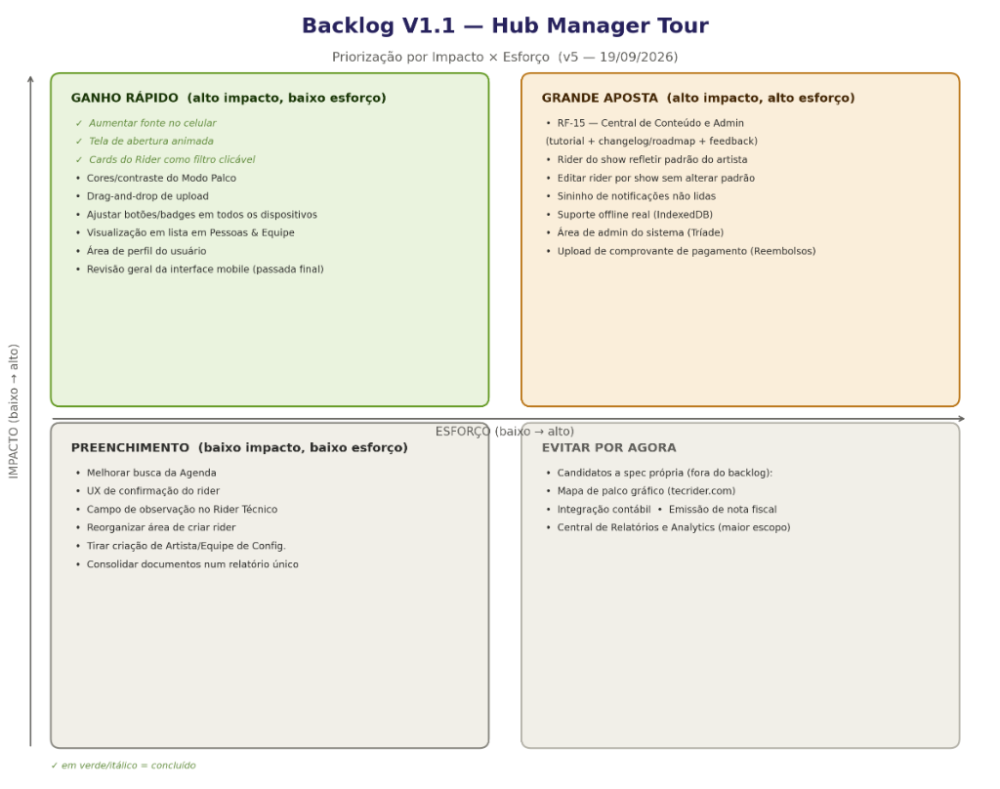

# Backlog V1.1 — Hub Manager Tour

> Priorizado em 17/09/2026 via matriz Impacto × Esforço. Sequência 
> recomendada: Ganho Rápido → Grande Aposta → Preenchimento.

## Ganho rápido (alto impacto, baixo esforço) — fazer primeiro
- [CONCLUÍDO] Aumentar fonte no celular → resolvido em duas partes: correção de unidade (px → rem) + controle manual A-/A+ em 3 níveis (Opção B), disponível para produtor e rotas públicas.
- [CONCLUÍDO] Tela de abertura animada (item adicional, fora da lista original, adicionado durante a execução).
- Cores/contraste do Modo Palco
- [CONCLUÍDO] Cards do Rider como filtro clicável
- Drag-and-drop de upload
- Ajustar botões/badges em todos os dispositivos
- Visualização em lista em Pessoas & Equipe
- Área de perfil do usuário
- Revisão geral da interface mobile (passada final, depois dos demais)

## Grande aposta (alto impacto, alto esforço) — priorizar, mas planejar bem
- RF-15 — Central de Conteúdo e Administração (rascunho, ainda não 
  formalizado com critério de aceite completo): consolida em uma 
  única funcionalidade o tutorial (texto + vídeo via link/embed do 
  Panda Vídeo, sem upload de arquivo), o changelog/roadmap de 
  novidades, e o canal de feedback (bug/sugestão) com notificação 
  por e-mail para contato@triadetecnologiaesolucoes.com.br. Acesso 
  de administrador restrito por e-mail via variável de ambiente 
  (ADMIN_EMAIL), sem sistema de papéis completo nesta fase.
- Rider do show precisa refletir atualizações feitas depois no rider 
  padrão do artista
- Editar rider de um show específico sem alterar o rider padrão do 
  artista
- Sininho de notificações não lidas no menu
- Suporte offline real (IndexedDB) para o Modo Palco
- Área de admin do sistema (Tríade)
- Upload de comprovante de pagamento na aba Reembolsos: ao marcar 
  um reembolso como pago, permitir ao produtor anexar o comprovante 
  do Pix realizado (guardado junto ao registro), com possibilidade 
  de a marcação de 'reembolsado' acontecer automaticamente ao subir 
  o arquivo, em vez de (ou além de) alternar manualmente o switch 
  atual. Esforço médio (reaproveita padrão de upload já existente 
  no sistema, sem rota pública envolvida) — próximo candidato 
  depois do RF-15. Precisa de definição de produto antes do desenho 
  técnico: onde o comprovante fica armazenado, se o upload é 
  obrigatório ou complementar ao toggle manual, e se a marcação 
  automática é definitiva ou ainda passa por confirmação.

## Preenchimento (baixo impacto, baixo esforço) — fazer quando sobrar tempo
- Melhorar mecanismo de busca da Agenda
- Melhorar UX de confirmação do rider
- Campo de observação no documento de Rider Técnico
- Revisar organização da área de criar rider
- Tirar criação de Artista/Equipe/Rider de Configurações
- Consolidar documentos (passagens/notas/cupons) num relatório único

## Já entregue (fora deste backlog)
- Tema claro/escuro (RF-12)
- Navegação adaptável cabeçalho/sidebar (RF-13)
- Negociação de exceção de rider via réplica/tréplica (RF-14)
- Instalação como PWA no Android

## Fora do backlog — ver specs/candidatos-novas-specs.md
- Benchmarking tecrider.com, integração com contabilidade e emissão de 
  nota fiscal saíram deste backlog por exigirem escopo próprio — 
  registrados em arquivo separado.

---

> Desenho de UI/UX do card 'Pessoas com Documentos': specs/design/pessoas-com-documentos-uiux.md

