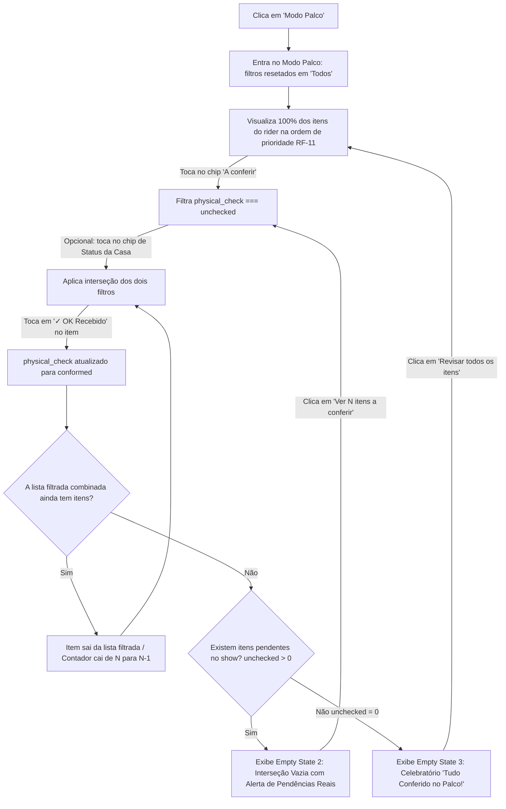

# Desenho de UI/UX — Filtros Nativos do Modo Palco

> **Status:** Aprovado para implementação técnica  
> **Skill:** `ui-ux-produto-digital`  
> **Módulo/Tela:** Aba Rider Técnico · Modo Palco (`src/routes/shows.$id.tsx` — `isStageMode === true`)  
> **Branch:** `spec-001-modulo-1-v1-previa`

---

## 1. Contexto, Persona e Ergonomia de Palco

- **Persona:** Roadie, Técnico de PA, Técnico de Monitor, Iluminador, Produtor de Palco.
- **Ambiente Físico Extremo:**
  - Iluminação adversa: luz solar direta cegante em festivais ao ar livre ou escuridão profunda com fumaça e luzes estroboscópicas em casas de show noturnas.
  - Operação com **uma única mão (polegar)** em smartphone: a outra mão frequentemente segura cabos, cases, microfones ou lanternas.
  - Pressão de tempo: contagem regressiva crítica para a passagem de som (*soundcheck*).
- **Objetivo da Funcionalidade:**
  - Permitir que o técnico filtre a lista para focar exclusivamente no que ainda falta conferir (`unchecked`), gerando o efeito operacional de **"checklist esvaziando"** conforme ele audita o equipamento físico no palco.
  - Oferecer filtros combináveis entre **Conferência Física** e **Status vindo da Casa de Show**, mantendo controle e visibilidade 100% locais sem os riscos de filtros herdados silenciosamente de outras abas.

---

## 2. Decisões de Design e Justificativas por Heurísticas de Nielsen

### Decisão 1: Onde os dois controles ficam na tela do Modo Palco sem competir com os botões grandes de ação (≥ 48px)?
> **Decisão:** **Transformar os contadores de cabeçalho nos próprios botões de filtro clicáveis (Pill Chips) + linha secundária compacta de Status da Casa.**

#### Justificativa por Heurísticas de Usabilidade:
1. **Heurística 8 (Design Estético e Minimalista) & Economia Cognitiva:**
   - O cabeçalho do Modo Palco já apresenta 3 métricas essenciais: `{unchecked} a conferir`, `{conformed} OK`, `{divergent} divergência(s)`.
   - Adicionar botões separados ou menus dropdown adicionaria poluição visual, rolagem desnecessária e disputa de espaço vertical.
   - **Solução:** Os próprios badges numéricos tornam-se pílulas táteis (`min-h-[40px]`). Um toque no badge *"12 a conferir"* ativa o filtro instantaneamente.
2. **Heurística 4 (Consistência e Padrões) & Heurística 6 (Reconhecimento em vez de Memorização):**
   - Abaixo das pílulas principais de conferência física, organiza-se uma linha horizontal compacta de chips para o status da casa: `Casa: [ Todos ] [ Confirmados ] [ Exceções ] [ Pendentes ]`.
   - O técnico reconhece visualmente em 1 segundo quais critérios estão aplicados, sem precisar abrir menus suspensos que encobrem o palco.

---

### Decisão 2: Como tratar os estados de "lista filtrada vazia" (Diferenciação Crítica de Empty States)?
> **Decisão:** **Três estados vazios visualmente e semanticamente distintos, evitando falso feedback positivo de segurança.**

#### Justificativa por Heurísticas de Usabilidade:
1. **Heurística 1 (Visibilidade do Status do Sistema) & Heurística 5 (Prevenção de Erros):**
   - Se o técnico filtrar por uma combinação que resulta em 0 itens (ex.: *"A conferir"* + *"Exceção da casa"*), mas ainda existirem 4 itens pendentes com status *"Confirmado pelo espaço"*, **NUNCA** deve ser exibida a mensagem de *"Tudo conferido no palco!"*. Fazer isso geraria um falso positivo gravíssimo, induzindo o técnico a liberar o palco com equipamentos faltantes.
   - **Tratamento rigoroso dos 3 Empty States:**
     - **Estado Celebratório (Tudo Conferido):** Disparado apenas quando a contagem global `stageStats.unchecked === 0` (todos os itens do show foram auditados). Exibe ícone esmeralda, celebração e resumo consolidado.
     - **Estado de Interseção Vazia com Pendências Reais:** Disparado quando a lista filtrada tem 0 itens, mas o global `stageStats.unchecked > 0`. Exibe ícone informativo, alerta de que *"Ainda restam N itens a conferir com outro status da casa"* e botão de atalho direto para ver todos os pendentes de conferência física.
     - **Estado de Categoria sem Ocorrências:** Disparado quando o técnico clica em "Divergências" e `stageStats.divergent === 0`. Exibe *"Nenhuma divergência registrada no palco"*, confirmando que tudo auditado até o momento está conforme.

---

### Decisão 3: Persistência do filtro entre entradas/saídas do Modo Palco
> **Decisão:** **Resetar para "Todos" (`all`) sempre que o Modo Palco for aberto.**

#### Justificativa por Heurísticas de Usabilidade:
1. **Heurística 5 (Prevenção de Erros de Segurança Operacional):**
   - O Modo Palco existe para conferência física presencial. Se o técnico acessou o Modo Palco há 40 minutos, ativou um filtro pontual, saiu e agora retorna na correria da passagem de som, ele precisa ter a certeza absoluta de que está diante do **quadro integral do rider**.
   - Garantir que cada entrada inicialize com 100% dos itens visíveis elimina qualquer risco de conferência parcial por distração.
2. **Heurística 3 (Controle e Liberdade do Usuário):**
   - Uma vez dentro do Modo Palco na mesma sessão, o técnico clica em *"A conferir (X)"* em 1 segundo e o filtro permanece ativo enquanto ele audita os equipamentos.

---

## 3. Wireframes de Baixa Fidelidade e Estados da Interface

### Estado 1 — Modo Palco com Filtros Clicáveis no Topo
*Os contadores de conferência física funcionam como pílulas de filtro com anel de seleção ativo.*

```text
┌──────────────────────────────────────────────────────────────────┐
│ ● MODO PALCO · CONFERÊNCIA FÍSICA              [ Sair do Modo ]  │
│                                                                  │
│ CONFERÊNCIA NO PALCO (FILTRO PRIMÁRIO):                          │
│ ┌──────────────┐ ┌────────────────────┐ ┌────────┐ ┌───────────┐ │
│ │ Todos (18)   │ │ ● 12 a conferir    │ │ 5 OK   │ │ 1 Diverg. │ │
│ └──────────────┘ │ [ ring-2 emerald ] │ └────────┘ └───────────┘ │
│                  └────────────────────┘                          │
│ STATUS DA CASA (FILTRO SECUNDÁRIO):                              │
│ [ ● Todos ] [ Confirmados ] [ Exceções ] [ Pendentes ]           │
└──────────────────────────────────────────────────────────────────┘

┌─ ITEM 1 DE 12 (A CONFERIR) ──────────────────────────────────────┐
│ [ SOM ] [ Inegociável ]                                          │
│ Par de Monitores de Chão 15" · x2                                │
│ Status da Casa: Confirmado pelo espaço                           │
│ Estado no Palco: [ A conferir ]                                  │
│                                                                  │
│ ┌──────────────────────────────┐ ┌─────────────────────────────┐ │
│ │  ✓ OK RECEBIDO (≥ 48px)      │ │  ⚠ DIVERGÊNCIA (≥ 48px)     │ │
│ └──────────────────────────────┘ └─────────────────────────────┘ │
└──────────────────────────────────────────────────────────────────┘
```

---

### Estado 2 — Interseção Vazia com Pendências Reais (NOVO)
*Ocorre quando a combinação dos dois filtros não tem itens (ex.: "A conferir" + "Exceção da casa"), mas o palco ainda tem itens pendentes.*

```text
┌──────────────────────────────────────────────────────────────────┐
│ CONFERÊNCIA NO PALCO:                                            │
│ [ Todos (18) ]  [ ● 4 a conferir ]  [ 13 OK ]  [ 1 Diverg. ]     │
│ STATUS DA CASA:                                                  │
│ [ Todos ]  [ Confirmados ]  [ ● Exceções ]  [ Pendentes ]        │
└──────────────────────────────────────────────────────────────────┘

┌──────────────────────────────────────────────────────────────────┐
│                         ╭───────────╮                            │
│                         │     🔍    │                            │
│                         ╰───────────╯                            │
│                                                                  │
│          NENHUM ITEM COM ESTA COMBINAÇÃO DE FILTROS              │
│   Não há itens em exceção aguardando conferência física.         │
│                                                                  │
│   ⚠ ATENÇÃO: Ainda restam 4 itens a conferir no palco            │
│   com outros status da casa de show (ex: confirmados).           │
│                                                                  │
│   ┌──────────────────────────────────────────────────────┐       │
│   │   VER TODOS OS 4 ITENS A CONFERIR NO PALCO [≥ 48px]  │       │
│   └──────────────────────────────────────────────────────┘       │
│   ┌──────────────────────────────────────────────────────┐       │
│   │   VER TODOS OS 18 ITENS DO RIDER                     │       │
│   └──────────────────────────────────────────────────────┘       │
└──────────────────────────────────────────────────────────────────┘
```

---

### Estado 3 — 100% Celebratório: Tudo Conferido no Palco
*Ocorre estritamente quando `stageStats.unchecked === 0` (todos os itens do rider foram conferidos).*

```text
┌──────────────────────────────────────────────────────────────────┐
│                         ╭───────────╮                            │
│                         │  ✓✓ 100%  │                            │
│                         ╰───────────╯                            │
│                                                                  │
│                 TUDO CONFERIDO NO PALCO!                         │
│       100% dos equipamentos do show foram auditados.             │
│                                                                  │
│       • 17 itens recebidos conforme                              │
│       • 1 divergência registrada (avise a produção do show)      │
│                                                                  │
│       ┌──────────────────────────────────────────────────┐       │
│       │    REVISAR TODOS OS ITENS DO RIDER (18) [≥ 48px] │       │
│       └──────────────────────────────────────────────────┘       │
└──────────────────────────────────────────────────────────────────┘
```

---

## 4. Mapeamento do Fluxo de Interação



---

## 5. Checklist de Acessibilidade e Uso no Palco (WCAG 2.2 AA / POUR)

1. **Perceptível (Perceivable):**
   - Contraste visual reforçado para penumbra (`bg-zinc-950` / `bg-zinc-900`) com texto branco e rótulos luminosos.
   - Pílula ativa indicada por anel duplo (`ring-2 ring-emerald-500` para OK, `ring-2 ring-amber-500` para divergências e `ring-2 ring-primary` para geral).
2. **Operável (Operable):**
   - Pílulas do filtro primário com altura mínima de 40px no celular e espaçamento amplo (`gap-2`) para uso com uma mão só.
   - Botões de ação em cada card mantêm **estritamente a altura mínima de 48px** e feedback de toque em 120ms (`active:scale-[0.97]`).
   - Botões de CTA nos Empty States possuem **48px de altura de toque**.
3. **Compreensível (Understandable):**
   - Separação semântica clara entre o que é conferência física presencial (OK / Divergência) e o que é posicionamento contratual da casa de show (Confirmado / Exceção / Pendente).
   - O técnico nunca fica com a tela vazia sem saber o motivo ou o que fazer em seguida.
4. **Robusto (Robust):**
   - Operação 100% em memória no cliente: funções puras `filterRiderItemsByStatus` e `filterByPhysicalCheck` em `g3.ts`, sem requisições adicionais de rede.
