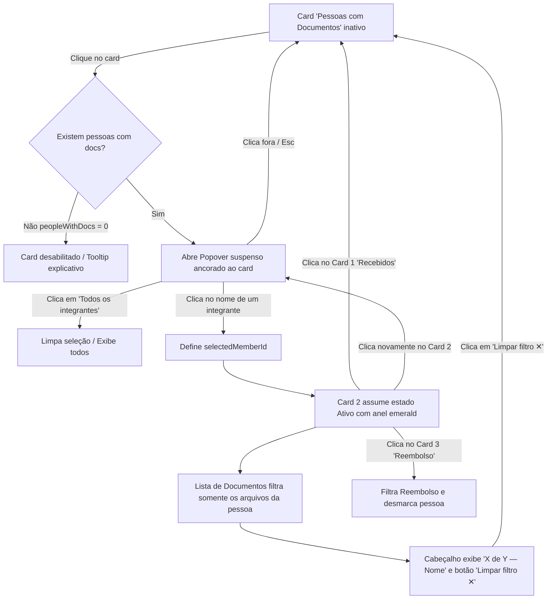

# Desenho de UI/UX — Card "Pessoas com Documentos"

> **Status:** Aprovado para implementação técnica  
> **Skill:** `ui-ux-produto-digital`  
> **Módulo/Tela:** Aba Documentos (`src/routes/shows.$id.tsx` — `activeTab === "docs"`)  
> **Branch:** `spec-001-modulo-1-v1-previa`

---

## 1. Contexto, Persona e Objetivo

- **Persona:** Produtor de turnê / Road manager / Produção executiva.
- **Cenário de uso:** Em trânsito, em dias corridos de montagem ou prestação de contas, precisando auditar ou localizar urgentemente um comprovante específico (ex.: *"Cadê o cartão de embarque do baterista?"* ou *"A van do técnico de PA já foi anexada?"*).
- **Problema atual:** A lista de comprovantes e vouchers exibe todos os documentos do show em ordem cronológica de envio. Conforme a equipe cresce (10 a 30+ integrantes) e os uploads somam dezenas de arquivos, encontrar os comprovantes de uma pessoa específica exige rolagem exaustiva ou busca improvisada via navegador.
- **Dados disponíveis no cliente:** Cada documento (`docs`) já possui `cast_member_id`, e o elenco (`cast`) já está carregado no componente com `id`, `name` e `role`. Não há necessidade de nova consulta ao banco de dados — trata-se de reorganização e filtragem reativa local.
- **Objetivo do recurso:** Servir como atalho rápido e direto para o produtor isolar os documentos de um integrante específico, sem fricção e sem perder o contexto do show.

---

## 2. Decisões de Design e Justificativas por Heurísticas de Nielsen

### Decisão 1: Onde a lista de nomes aparece ao clicar no card?
> **Decisão:** **Dropdown / Popover suspenso ancorado ao card** (com comportamento responsivo: Popover ancorado no desktop/tablet e Sheet/Modal inferior no mobile).

#### Justificativa por Heurísticas de Usabilidade:
1. **Heurística 4 (Consistência e Padrões) & Lei de Jakob:**
   - Na aba Documentos, os três cards dividem o mesmo grid horizontal (`grid grid-cols-1 sm:grid-cols-3`).
   - Uma **expansão inline** (tipo gaveta/sanfona) causaria dois problemas estruturais graves: ou quebraria a simetria da grade gerando um desnível assimétrico no card central, ou empurraria abruptamente toda a lista de documentos para baixo (*Cumulative Layout Shift - CLS*), desorientando a visão do usuário.
   - O padrão de mercado consolidado para "botão de filtro com seleção de valor" é um card com affordance de menu (`▾`) que abre um **popover flutuante**, mantendo o layout de base 100% estável.
2. **Heurística 3 (Controle e Liberdade do Usuário):**
   - O popover flutuante possui saídas de emergência naturais e universais: clicar fora (*click outside*), pressionar a tecla `Esc`, ou clicar novamente no card. Na expansão inline, o usuário ficaria com o layout expandido até localizar o gatilho de recolhimento.
3. **Heurística 8 (Design Estético e Minimalista):**
   - A lista de nomes é uma ferramenta transitória — serve apenas para selecionar o integrante desejado. Ela não deve competir visualmente com a lista de comprovantes abaixo.
4. **Heurística 6 (Reconhecimento em vez de Memorização):**
   - O dropdown não exibe só uma lista seca de nomes: cada item mostra o **Nome**, o **Papel/Função** (ex.: *Guitarrista*, *Técnico de PA*) e o **Contador de docs** (ex.: *3 docs*). O produtor reconhece a pessoa pela função e já sabe de antemão quantos documentos vai encontrar.

---

### Decisão 2: O filtro por pessoa é exclusivo ou combinável com reembolso?
> **Decisão:** **Filtro Exclusivo nesta v1** (apenas 1 critério ativo por vez na barra de cards).

#### Justificativa por Heurísticas de Usabilidade:
1. **Heurística 5 (Prevenção de Erros / Prevenção de Estado Vazio Frustrante):**
   - Se os filtros combinassem (`Pessoa X` + `Reembolso`), a probabilidade de gerar listas vazias com frequência seria altíssima: muitos integrantes enviam apenas documentos obrigatórios de logística (RG, vacina, passagens) e **nenhum** comprovante de despesa. Ao clicar em ambos, o produtor veria uma lista zerada e teria a falsa impressão de erro no sistema ou perda de dados.
2. **Heurística 1 (Visibilidade do Status do Sistema) & Heurística 4 (Consistência):**
   - Os 3 cards superiores atuam no mesmo nível hierárquico como um **filtro segmentado da aba** (Tabs de contexto):
     - **Card 1 (Documentos Recebidos):** Exibe 100% dos documentos do show.
     - **Card 2 (Pessoas com Documentos):** Exibe apenas os documentos do integrante selecionado.
     - **Card 3 (Documentos para Reembolso):** Exibe apenas documentos com despesa para reembolso.
   - Qualquer card clicado substitui a visão ativa com clareza cristalina no cabeçalho da lista.
3. **Alinhamento de Domínio e Evolução Futura:**
   - A aba dedicada **Reembolsos** (`activeTab === "reimbursements"`) já existe especificamente para prestação de contas financeira detalhada por pessoa (com chave Pix, soma monetária e comprovantes). Na aba **Documentos**, o foco é operacional (conferência geral de arquivos). O filtro exclusivo mantém a interface direta e sem sobrecarga cognitiva.

---

## 3. Wireframes de Baixa Fidelidade e Estados da Interface

### Estado A — Repouso (Nenhum integrante filtrado)
*O card exibe affordance clara de que é um seletor (ícone `ChevronDown` e cursor pointer).*

```text
┌───────────────────────────────┐ ┌───────────────────────────────┐ ┌───────────────────────────────┐
│ DOCUMENTOS RECEBIDOS  ● Ativo │ │ PESSOAS COM DOCUMENTOS      ▾ │ │ DOCUMENTOS PARA REEMBOLSO     │
│                               │ │                               │ │                               │
│ 14                            │ │ 5                             │ │ 4                             │
│ de 8 integrantes              │ │ ao menos 1 arquivo entregue   │ │ soma: R$ 850,00               │
└───────────────────────────────┘ └───────────────────────────────┘ └───────────────────────────────┘

┌─ LISTA DE COMPROVANTES E VOUCHERS (14) ──────────────────────────────────────────────────────────┐
│ [Linha do Documento 1 - Fulano]                                                                  │
│ [Linha do Documento 2 - Ciclano]                                                                 │
│ ...                                                                                              │
└──────────────────────────────────────────────────────────────────────────────────────────────────┘
```

---

### Estado B — Dropdown Aberto (Seleção do Integrante)
*Ao clicar no card 2, abre-se o popover flutuante ancorado logo abaixo dele, sem empurrar o restante da página.*

```text
                                  ┌───────────────────────────────┐
                                  │ PESSOAS COM DOCUMENTOS      ▴ │
                                  │                               │
                                  │ 5                             │
                                  │ selecionar integrante...      │
                                  └──────────────┬────────────────┘
                                                 │
                             ┌───────────────────┴───────────────────┐
                             │ FILTRAR POR INTEGRANTE (5)            │
                             ├───────────────────────────────────────┤
                             │ • Todos os integrantes                │
                             ├───────────────────────────────────────┤
                             │ 👤 Carlos Souza                       │
                             │    Músico / Baixo             3 docs  │
                             ├───────────────────────────────────────┤
                             │ 👤 Fernanda Lima                      │
                             │    Técnica de PA              4 docs  │
                             ├───────────────────────────────────────┤
                             │ 👤 Rodrigo Mello                      │
                             │    Roadie                     1 doc   │
                             ├───────────────────────────────────────┤
                             │ 👤 Tiago Ramos                        │
                             │    Iluminador                 2 docs  │
                             └───────────────────────────────────────┘
```

---

### Estado C — Integrante Selecionado (Filtro Ativo)
*O Card 2 assume o estilo ativo (ring verde/emerald). O cabeçalho da lista indica quem está filtrado e oferece o botão de escape "Limpar filtro ✕".*

```text
┌───────────────────────────────┐ ┌───────────────────────────────┐ ┌───────────────────────────────┐
│ DOCUMENTOS RECEBIDOS          │ │ PESSOAS COM DOCUMENTOS● Carlos│ │ DOCUMENTOS PARA REEMBOLSO     │
│                               │ │ [ ring-2 ring-emerald-500 ]   │ │                               │
│ 14                            │ │ 3 docs de Carlos Souza      ▾ │ │ 4                             │
│ de 8 integrantes              │ │ clique para trocar pessoa     │ │ soma: R$ 850,00               │
└───────────────────────────────┘ └───────────────────────────────┘ └───────────────────────────────┘

┌─ LISTA DE COMPROVANTES E VOUCHERS (3 de 14 — Carlos Souza) ──────────────────── [ Limpar filtro ✕ ] ──┐
│ [Doc 1: Comprovante de Embarque - Carlos Souza]                                                 │
│ [Doc 2: Voo Localizador ABC - Carlos Souza]                                                     │
│ [Doc 3: Certificado de Vacina - Carlos Souza]                                                   │
└─────────────────────────────────────────────────────────────────────────────────────────────────┘
```

---

## 4. Fluxograma Mermaid de Interação



---

## 5. Checklist de Acessibilidade (WCAG 2.2 AA / POUR)

1. **Perceptível (Perceivable):**
   - Relação de contraste de cor nos textos, nomes e badges mantida acima de 4.5:1 contra os fundos escuros do tema Nocturne (`bg-card` e `bg-popover`).
   - O estado ativo não se apoia exclusivamente na cor verde: inclui anel de foco (`ring-2 ring-emerald-500`), badge textual explícito (`● [Nome]` ou `● Ativo`) e o próprio cabeçalho contextual da lista.
2. **Operável (Operable):**
   - Altura de toque mínima (*touch target*) de 44px para cada linha de integrante no menu suspenso em telas sensíveis ao toque.
   - Gatilho do card implementado como `<button type="button">` com atributos ARIA adequados: `aria-haspopup="listbox"` e `aria-expanded={isOpen}`.
   - Fechamento imediato com tecla `Escape` e suporte a navegação por teclado.
3. **Compreensível (Understandable):**
   - Sem termos técnicos ou códigos: rótulos claros como *"ao menos 1 arquivo entregue"*, *"Filtrar por integrante"* e *"Limpar filtro ✕"*.
   - A contagem `(X de Y — Nome)` deixa evidente que a visualização está restrita a uma fração do total.
4. **Robusto (Robust):**
   - Tratamento do estado de borda: se `progress.peopleWithDocs === 0`, o card fica visualmente inativo (`opacity-50`, cursor não permitido e sem abrir popover vazio), evitando estados de erro.

---

## 6. Sistema Leve de Componentes (Atomic Design)

- **Átomo:** Badge de contagem (`<span className="font-mono text-xs text-muted-foreground">X docs</span>`), Ícone de chevron indicador de abertura (`<ChevronDown className="size-3.5" />`).
- **Molécula:** Linha de seleção do integrante no menu (`avatar/ícone + nome + cargo + badge de contagem`).
- **Organismo:** `MemberDocsFilterPopover` ancorado ao card "Pessoas com Documentos", sincronizado com o estado `selectedMemberId` e `docsFilter`.
